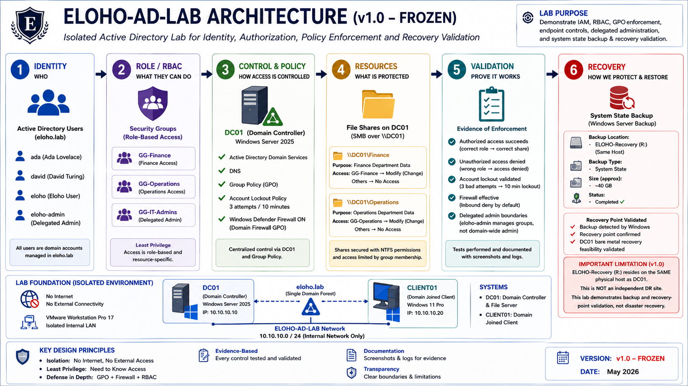

# Project ELOHO — Active Directory Security Lab

An evidence-based Active Directory lab demonstrating identity and access management, role-based access control, centralized security policy, delegated administration, and recovery validation in an isolated Windows domain environment.

## Overview

Project ELOHO was built to move beyond describing security concepts and demonstrate them through implementation and validation.

The lab uses a Windows Server 2025 domain controller and a domain-joined Windows 11 client to test how identity, authorization, policy enforcement, privileged access, and recovery controls behave in practice.

## What I Implemented

| Area | Implementation | Validation |
|---|---|---|
| **Identity & RBAC** | AD users, security groups, and NTFS/SMB permissions | Authorized role access succeeded; cross-role access was denied |
| **Policy Enforcement** | Domain Group Policy, Windows Defender Firewall, and account lockout controls | Security policies were applied and validated on the domain-joined client |
| **Privileged Access** | Separate `eloho-admin` identity with narrowly delegated administrative authority | Delegated password reset succeeded; broader user creation was denied |
| **Recovery** | Windows Server Backup of DC01 System State | Backup completed and the System State recovery point was recognized as available |

## Lab Environment

- **Domain:** `eloho.lab`
- **DC01:** Windows Server 2025 — `10.10.10.10`
- **CLIENT01:** Windows 11 — `10.10.10.20`
- **Network:** `ELOHO-AD-LAB` isolated VMware LAN segment
- **Internet connectivity:** None in the frozen lab configuration

## Evidence

The repository contains a curated evidence set rather than every screenshot produced during the build.

- [Architecture](evidence/01-architecture/)
- [Identity & RBAC](evidence/02-identity-rbac/)
- [Policy & Enforcement](evidence/03-policy-enforcement/)
- [Privileged Access](evidence/04-privileged-access/)
- [Recovery](evidence/05-recovery/)

The evidence demonstrates both **successful authorization** and **intentional denial**, allowing controls to be evaluated by their observed behaviour rather than configuration alone.

## Recovery Scope

DC01 System State was backed up using Windows Server Backup. The backup completed successfully and was subsequently recognized as an available System State recovery point.

An actual restoration was **not performed** against the healthy domain controller.

The recovery volume is a separate virtual disk but resides on the **same physical VMware host** as DC01. This therefore demonstrates **backup and recovery-point validation**, not an independent or off-site disaster recovery implementation.

## Status

**v1.0 — Frozen**

The validated lab configuration has been frozen to preserve the relationship between the implemented controls and the evidence published in this repository.
