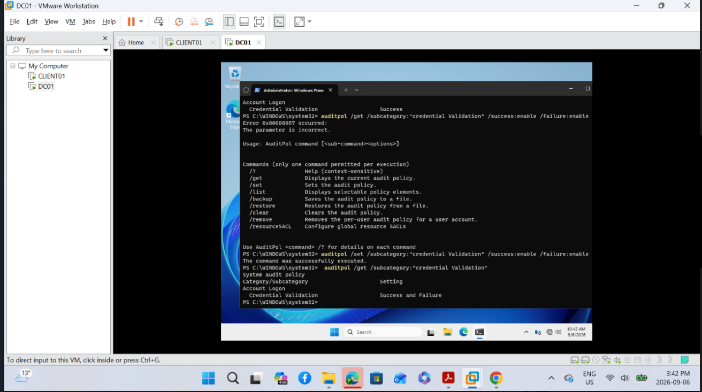
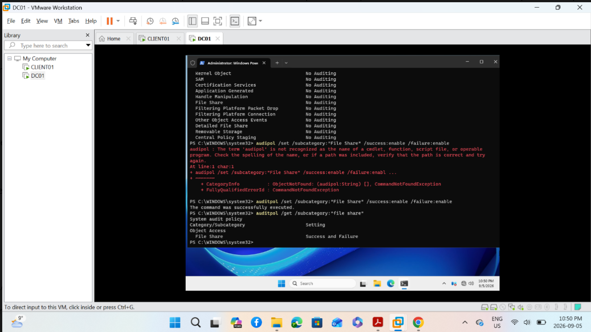
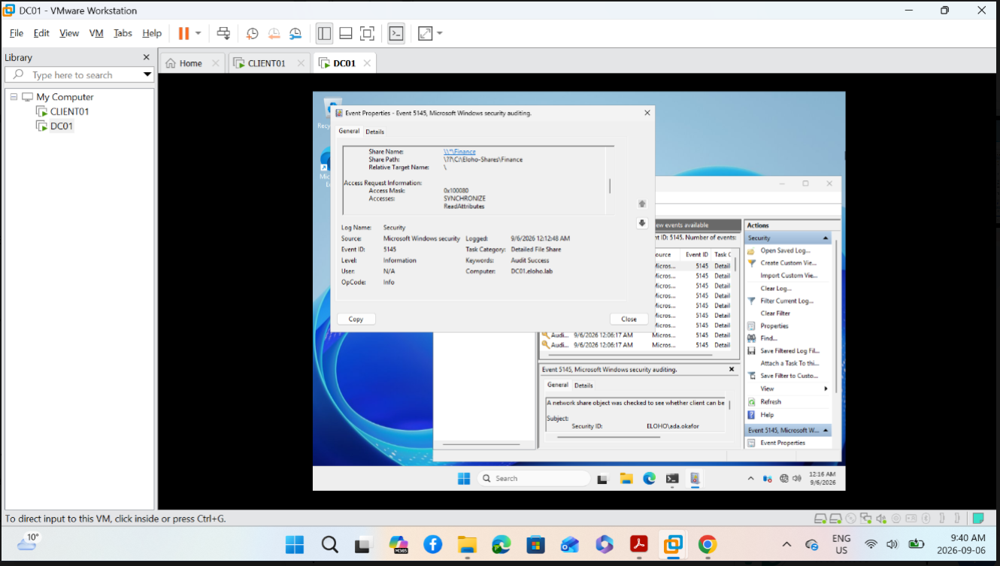
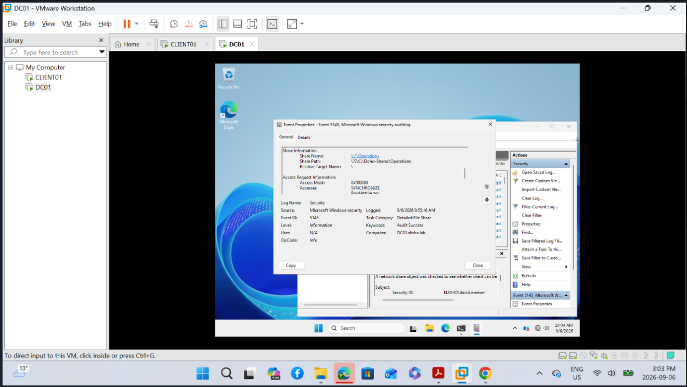

# Auditing & Accountability

Evidence demonstrating security audit configuration and attributable activity within the ELOHO Active Directory lab.
## Credential Validation Auditing

Credential validation auditing was configured to record both successful and failed authentication activity.

## File Share Auditing

File-share auditing was configured to record both successful and failed access activity.

## Attributable Finance Share Activity

A successful file-share access event was recorded for `ELOHO\ada.okafor` accessing the Finance share, linking the activity to a specific authenticated identity.

## Attributable Operations Share Activity

A successful file-share access event was recorded for `ELOHO\david.menser` accessing the Operations share, linking the activity to a specific authenticated identity.

